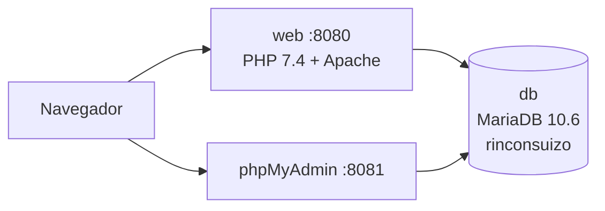

# Rinconsuizo Restaurante

Sistema de gestión para restaurantes (POS, ventas, inventario, delivery) con tienda online pública. Desarrollado en **PHP** con **MySQL/MariaDB**.

## Estructura del proyecto

```
Rinconsuizo-Restaurante/
├── index.php              # Tienda online / carrito público
├── db/                    # Framework MVC del ecommerce y facturación
├── sistema/               # Panel interno (admin, caja, mesero, cocina...)
├── rinconsuizo.sql        # Dump principal de la base de datos (USAR ESTE)
├── restord.sql            # Backup antiguo (abril 2022, nombre "restord")
├── docker-compose.yml     # Orquestación Docker
└── Dockerfile             # Imagen PHP + Apache
```

## Base de datos: ¿cuál usar?

El proyecto acumula varios dumps SQL de distintas etapas. **La base de datos activa es `rinconsuizo`**.

| Archivo | Base de datos | Estado | Uso |
|---------|---------------|--------|-----|
| **`rinconsuizo.sql`** (raíz) | `rinconsuizo` | **Actual** (jun 2026) | Importar este en producción/Docker |
| `restord.sql` (raíz) | `restord` | Antiguo (abr 2022) | Solo referencia histórica |
| `sistema/db_sql/softrestaurant_backup_24-03-2021.sql` | `softrestaurant` | Plantilla original | No usar; es el proyecto base |
| `sistema/db_sql/mediospagos.sql` | `resto` | Parcial | Solo tabla `mediospagos` (migración suelta) |

### Conexión en código

| Módulo | Archivo de config | BD configurada |
|--------|-------------------|----------------|
| Panel `sistema/` | `sistema/class/classconexion.php` | `rinconsuizo` |
| Ecommerce `db/` | `db/core/controller/Database.php` | `rinconsuizo` |
| Facturación/email | `db/model/db.php` | `rinconsuizo` (antes `resto`, unificado) |

> **Nota:** `sistema/backup.php` aún referencia `restaurante2020` de forma hardcodeada. Actualízalo manualmente si usas backup/restore desde el panel.

### Motor de base de datos

- **MySQL / MariaDB** (compatible con MariaDB 10.1+)
- Charset: `utf8` / `utf8mb4`
- Zona horaria app: `America/Caracas`

## Arquitectura Docker



| Servicio | Puerto | Descripción |
|----------|--------|-------------|
| `web` | 8080 | Aplicación PHP (tienda + `/sistema`) |
| `db` | 3306 | MariaDB con datos de `rinconsuizo.sql` |
| `phpmyadmin` | 8081 | Administración visual de la BD |

### Requisitos

- [Docker Desktop](https://www.docker.com/products/docker-desktop/) (Windows/Mac/Linux)

### Arranque rápido

```bash
# 1. Copiar variables de entorno
cp .env.example .env

# 2. Construir y levantar servicios
docker compose up -d --build

# 3. Esperar ~30s a que MariaDB importe rinconsuizo.sql (solo la primera vez)
docker compose logs -f db
```

### URLs

- **Tienda online:** http://localhost:8080
- **Panel del restaurante:** http://localhost:8080/sistema
- **phpMyAdmin:** http://localhost:8081

### Credenciales de acceso al sistema

Según documentación original (`sistema/db_sql/LEEME.txt`):

| Rol | Usuario | Clave |
|-----|---------|-------|
| Administrador | RUBENCHIRINOS | NELSONFRAN |
| Cajero | MARBELLAPAREDES | MARBELLAPAREDES |
| Mesero | MOISESRODOLFO | MOISESRODOLFO |
| Cocinero | COCINERO | COCINERO |
| Repartidor | RAMONANTONIO | RAMONANTONIO |

### Comandos útiles

```bash
# Ver logs
docker compose logs -f web

# Parar servicios
docker compose down

# Parar y borrar datos de BD (reimporta el SQL al volver a levantar)
docker compose down -v

# Entrar al contenedor web
docker compose exec web bash
```

### Variables de entorno

Copia `.env.example` a `.env`. Las credenciales se inyectan automáticamente en PHP vía `DB_HOST`, `DB_USER`, `DB_PASS`, `DB_NAME`.

## Instalación manual (sin Docker)

1. PHP >= 7.4 con extensiones: `pdo_mysql`, `mysqli`, `gd`, `mbstring`, `zip`
2. Apache con `mod_rewrite`
3. MySQL/MariaDB
4. Crear BD `rinconsuizo` e importar `rinconsuizo.sql`
5. Editar credenciales en `sistema/class/classconexion.php` y `db/model/db.php`
6. Apuntar el DocumentRoot de Apache a la raíz del proyecto

## Subir a GitHub

```bash
# Inicializar repositorio (si aún no existe)
git init

# Configurar identidad (solo la primera vez en tu máquina)
git config user.name "Tu Nombre"
git config user.email "tu@email.com"

# Primer commit
git add .
git commit -m "Initial commit: sistema restaurante Rinconsuizo con Docker"

# Crear repo en GitHub (https://github.com/new) y enlazar
git branch -M main
git remote add origin https://github.com/TU_USUARIO/rinconsuizo-restaurante.git
git push -u origin main
```

### Recomendaciones para GitHub

- **No subas** `.env` con contraseñas reales (ya está en `.gitignore`)
- Revisa que no haya credenciales SMTP u otros secretos en `db/view/config/`
- El dump `rinconsuizo.sql` contiene datos de prueba; valora usar uno sin datos sensibles para repos públicos

## Licencia

Proyecto privado / académico. Consultar con los autores antes de redistribuir.
